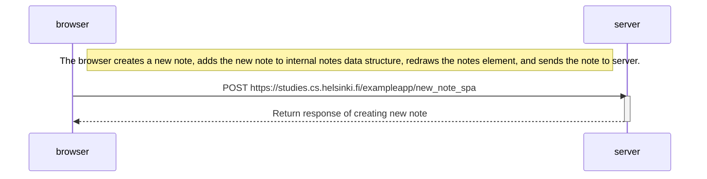

See exercise 0.5 from [link](https://fullstackopen.com/en/part0/fundamentals_of_web_apps#exercises-0-1-0-6).

```mermaid
sequenceDiagram
    participant browser
    participant server

    Note right of browser: The browser creates a new note, adds the new note to internal notes data structure,  redraws the notes element, and sends the note to server.

    browser->>server: POST https://studies.cs.helsinki.fi/exampleapp/new_note_spa
    activate server
    server-->>browser: Return response of creating new note
    deactivate server
```